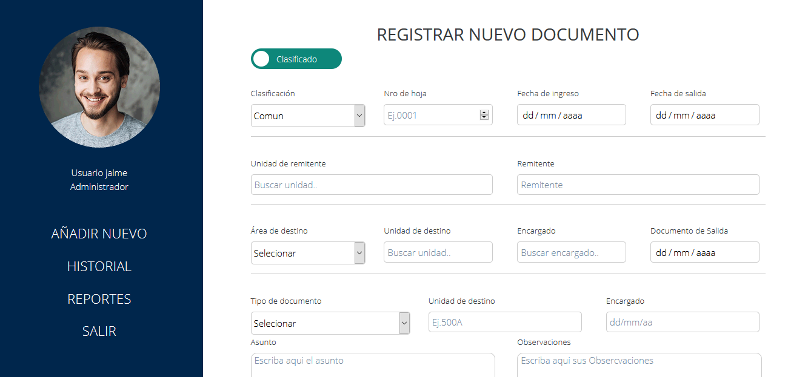

## Logistics Project PNP

 


## Lista de Contenidos

* [Descripción del proyecto](#descripción-del-proyecto)
* [Comenzando 🚀](#comenzando)
  * [Pre-requisitos](#pre-requisitos)
  * [Instalación](#instalación)
* [Ejecutando el Sistema ](#ejecutando-el-Sistema)
* [Versionado](#versionado)
* [Construido con](#construido-con)
* [Equipo de desarrolladores](#equipo-de-desarrolladores)
* [Contacto](#contacto)


## Descripción del proyecto

<p align="center">
  
</p>

Este  sistema se utiliza para registrar, organizar y encontrar todos estos documentos de manera electrónica y sencilla. Un sistema de gestión de trámite documentario tiene el poder de reunir todos estos documentos en un solo lugar.

## Comenzando 🚀

_Estas instrucciones te permitirán obtener una copia del proyecto en funcionamiento en tu máquina local para propósitos de desarrollo y pruebas._

Mira **Deployment** para conocer como desplegar el proyecto.

### Pre-requisitos

* Python en Window [Descargalo desde la pagina oficial](https://www.python.org/downloads/)
* Python en Ubuntu Linux
```sh
$ sudo apt-get install python3
```

### Instalación

1. Clonar repositorio
```sh
git clone https://gitlab.com/MadScientist98/sistema-de-tramite-documentario-y-logistica-pnp.git
```
2. Instalar paquetes de Python 
```pytho
python -m pip install django
```
3. Una vez completada la instalación, verificar su instalación 
```pytho
django-admin --version
```

### Dependencias

1. Instalar Django Material Administration. [Github](https://github.com/MaistrenkoAnton/django-material-admin).
```pytho
pip install django-material-admin
```
2. Instalar DJango Rest framework. [Sitio Oficial](https://www.django-rest-framework.org/)
```pytho
pip install djangorestframework
pip install markdown       # Markdown para una API navegable.
pip install django-filter   # Filtrado
```
3. Instalar la biblioteca de imágenes Pillow. [Github](https://github.com/python-pillow/Pillow)
```pytho
python -m pip install pillow
```
## Ejecutando el Sistema 

1. Ingresar a la carpeta ProyectoPNP y realizar el siguiente comando en consola

```pytho
python manage.py runserver
```
2. Dirigerte a tu navergador principal y escribir los siguiente

```pytho
http://127.0.0.1:8000/
```

## Versionado

Usamos [SemVer](http://semver.org/) para el versionado. Para todas las versiones disponibles, mira los [tags en este repositorio](https://gitlab.com/MadScientist98/sistema-de-tramite-documentario-y-logistica-pnp/-/tags).

## Construido con

_Herramientas usadas en el proyecto_

* [Python](https://www.python.org/) - Python es un lenguaje de programación interpretado cuya filosofía hace hincapié en la legibilidad de su código
* [Django](https://www.djangoproject.com/) - Django es un framework de desarrollo web de código abierto, escrito en Python,
* [SQL](https://es.wikipedia.org/wiki/SQL) - SQL es un lenguaje de dominio específico utilizado en programación, diseñado para administrar, y recuperar información de sistemas de gestión de bases de datos relacionales

### Equipo de desarrolladores 


* **Gonzalo Alejandro Caira Aguilar** - Correo : [gcairaa@unsa.edu.pe](gcairaa@unsa.edu.pe)
* **Jaime Francisco Torres Rodriguez** - Correo : [jtorresro@unsa.edu.pe](jtorresro@unsa.edu.pe)
* **Miguel Hermoza Loayza** - Correo : [mhermozal@unsa.edu.pe](mhermozal@unsa.edu.pe)
* **Maria Lourdes Apaza Chavez** - Correo : [mapazacha@unsa.edu.pe](mapazacha@unsa.edu.pe)
* **Gustavo Hernán Inca Chipana**  - Correo : [ginca@unsa.edu.pe](ginca@unsa.edu.pe)
* **Edgar André Subia Huamán** - Correo : [esubiah@unsa.edu.pe](esubiah@unsa.edu.pe)

## Contacto

Puede contactarse con nosotros a traves de nuestro correo 

[pnptramitedoc@gmail.com](pnptramitedoc@gmail.com)


Link del proyecto: [https://gitlab.com/MadScientist98/sistema-de-tramite-documentario-y-logistica-pnp](https://gitlab.com/MadScientist98/sistema-de-tramite-documentario-y-logistica-pnp)
